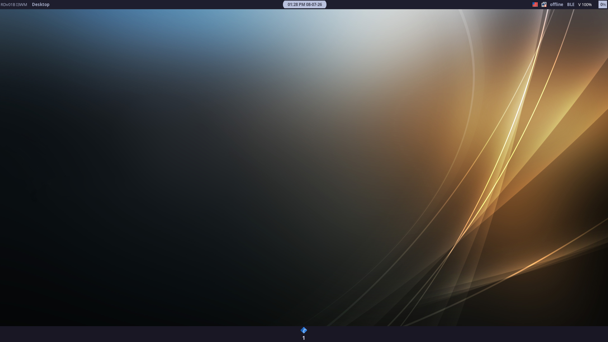
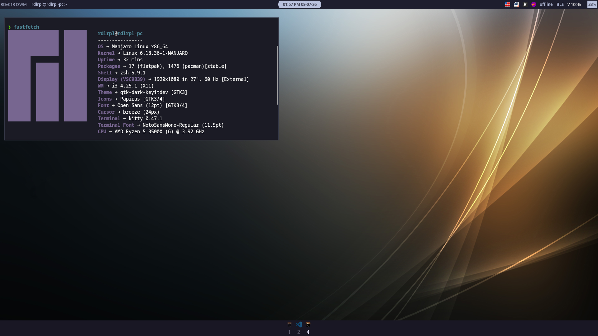

# I3WM Dotfiles




requirements
```
sudo pacman -S feh pavucontrol nemo network-manager-applet ttf-nerd-fonts-symbols ttf-iosevka-nerd polybar i3wm rofi dunst sddm flameshot python-i3ipc python-gobject gtk3 python-psutil

yay -S rofi-power-menu
yay -S sbxkb
yay -S thorium-browser-bin
```
